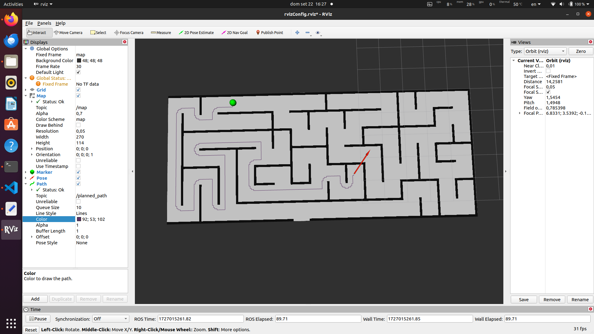
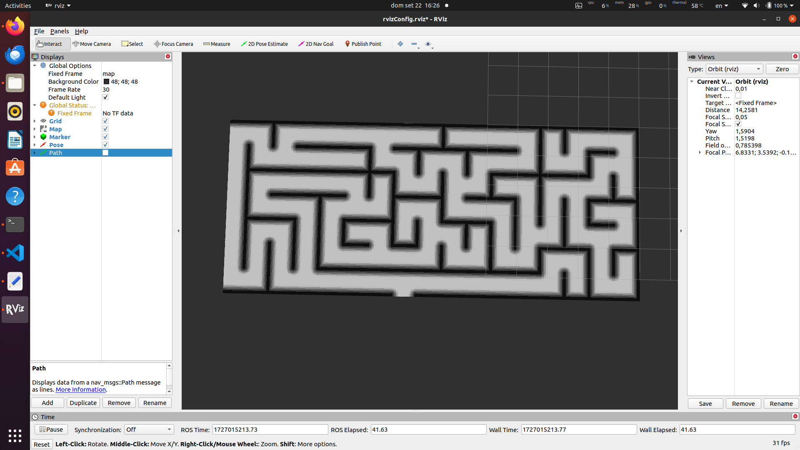

# **Simple Planner Project**

This project implements an A* path planning algorithm in ROS, along with several supporting nodes to load a map, visualize the robot’s path in RViz, and set the robot's initial position and goal. The project works on a map where each pixel represents a specific size in meters.


## **Version Information**

### **Version 1**
- The costmap calculation in Version 1 has a time complexity of **O(n^2)**. This version of the code is available in the git commit history in the repository.
- [Watch the video example VERSION 1 (commit f4724c0) ](https://drive.google.com/file/d/19fhCVT62H5O7-elryMddDX72EevoF78h/view?usp=sharing)

  
### **Version 2 (Current Version)**
 In the current version, OpenCV functions are used to compute the costmap in a more efficient way. This approach provides better performance and produces more desirable results compared to the previous method. The costmap is generated by defining an 'inflation area' around each obstacle. The closer a cell is to an obstacle, the higher its associated cost. This inflation area is determined by the inflation_radius variable, which specifies how far the increased cost extends from the obstacle. As you approach an obstacle within this radius, the cost increases gradually, creating a buffer zone that helps the planner avoid paths too close to obstacles.

example of path

costmap

meanwhile in version 2, the costmap:

## **Overview of the Project**

The project involves the following steps:
1. **Loading a static map**: The static map is loaded using the `map_server`, which provides an occupancy grid representation of the environment.
2. **Listening to the map and processing it**: The `grid_map_listener` node listens to the occupancy grid map and generates a costmap based on the obstacles in the environment.
3. **Setting the initial robot position**: The `initial_pose_marker` node is used to set the robot's initial position by publishing a marker in RViz.
4. **Setting the goal in RViz**: The goal position can be set using RViz's `2D Nav Goal` tool. And the initial position of the robot can be set using RViz's `2D Pos Estimate` tool.  The `A_star` node listens for this goal and computes the optimal path from the robot's initial position to the goal.
5. **Path planning with A***: The `A_star` node computes the shortest path using the A* algorithm and publishes the planned path for visualization in RViz.


## **Setup Instructions**

```bash
roscore
```

### **1. Load the Static Map**
The first step is to load the static map, which provides an occupancy grid of the environment. This is done using the `map_server`:

```bash
rosrun map_server map_server ~/catkin_ws/src/maps/map.yaml
```

- This command loads the map from the specified YAML file located in `~/catkin_ws/src/maps/`.

### **2. Run the Grid Map Listener**
The next step is to run the `grid_map_listener` node. This node listens to the map, processes it to generate a costmap, and handles obstacles.
We generate a costmap from the occupancy grid map. The costmap assigns costs to each grid cell based on the distance to the nearest obstacle, making the path planning more safe by avoiding high-cost areas.

```bash
rosrun simple_planner grid_map_listener
```

### **3. Start the A* Planner**
Run the `A_star` node, which computes the optimal path using the A* algorithm:

```bash
rosrun simple_planner A_star
```

- This node listens to the initial pose and goal, and publishes the planned path on the `/planned_path` topic for visualization in RViz.

### **4. Set the Initial Pose with the Marker**
The `initial_pose_marker` node allows you to set the robot's initial position using a marker in RViz:

```bash
rosrun simple_planner initial_pose_marker
```

- This node sets the robot's initial position by publishing a marker that corresponds to the robot's starting point on the grid map. The initial pose is then fed into the A* planner.

### **5. Launch RViz for Visualization**
To visualize the map, robot, and planned path, launch RViz:

```bash
rosrun rviz rviz -d ~/catkin_ws/src/rvizConfig.rviz
```

- Once RViz is launched, you can set the initial pose of the robot and the goal position using the available tools in RViz.

